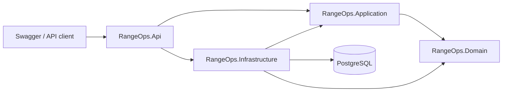
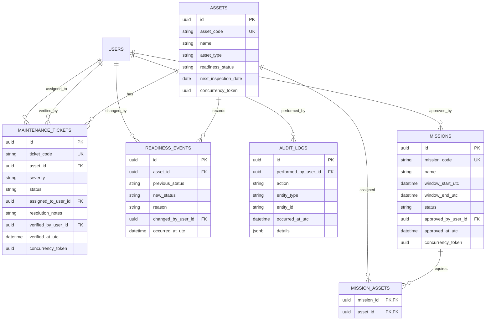

# Architecture

## Architectural style

RangeOps will be a **layered modular monolith** deployed as one API service with
one PostgreSQL database.

This keeps local development and deployment understandable while separating
business policy from HTTP and persistence concerns. Microservices are not
justified for the MVP.

## Planned solution projects

| Project | Responsibility |
| --- | --- |
| `RangeOps.Api` | Controllers, authentication entry point, middleware, OpenAPI, HTTP contracts |
| `RangeOps.Application` | Use cases, DTOs, authorization orchestration, interfaces, readiness service |
| `RangeOps.Domain` | Entities, value rules, state transitions, domain errors |
| `RangeOps.Infrastructure` | EF Core, PostgreSQL mappings, Identity, repositories, audit persistence |
| `RangeOps.UnitTests` | Fast tests for domain and application business rules |
| `RangeOps.IntegrationTests` | Real API tests backed by a Testcontainers PostgreSQL instance |

Dependencies point inward. The Domain project will not reference ASP.NET Core,
Entity Framework Core, or PostgreSQL.

## Data model

ASP.NET Core Identity will own the user and role tables. Application entities
will reference user identifiers rather than duplicate authentication data.

## Readiness evaluation

The application readiness service will load one consistent view of the mission,
its required assets, active tickets, and overlapping missions. It will evaluate
independent rules and return a collection of structured blockers.

Initial blocker codes are:

| Code | Meaning |
| --- | --- |
| `NO_REQUIRED_ASSETS` | The mission has no assigned required assets |
| `ASSET_NOT_OPERATIONAL` | The asset readiness status is not operational |
| `INSPECTION_OVERDUE` | Inspection expires before the mission starts |
| `CRITICAL_TICKET_OPEN` | A non-verified critical ticket exists |
| `MISSION_SCHEDULE_CONFLICT` | The asset is reserved by an overlapping mission |

The service will return codes plus human-readable reasons. Clients must rely on
codes for program logic and may display the reason to people.

## Cross-cutting decisions

- **Identifiers:** UUID primary keys plus unique human-readable asset, mission,
  and ticket codes.
- **Time:** Store timestamps in UTC. Use date-only values for inspection dates.
- **Errors:** RFC Problem Details with stable application error codes.
- **Authentication:** ASP.NET Core Identity with JWT bearer tokens usable from
  Swagger UI.
- **Authorization:** Role/policy-based checks, with a dedicated mission-approval
  policy.
- **Concurrency:** Explicit concurrency tokens on mutable aggregate records;
  stale writes return `409 Conflict`.
- **Scheduling races:** Asset assignment and approval use a transaction-scoped
  lock for each affected asset before checking overlapping windows, preventing
  two concurrent requests from reserving the same asset.
- **Audit:** Append-only audit records generated by application use cases, not by
  controllers.
- **Secrets:** Development secrets stay outside tracked configuration files.
- **Observability:** Structured console logging and health checks in the MVP.
- **API style:** Controller-based REST endpoints under `/api`; OpenAPI is the
  primary interactive interface.

## Important database constraints

- Asset codes, mission codes, and ticket codes are unique and case-insensitive.
- Mission end time must be later than mission start time.
- A mission cannot contain the same asset twice.
- Draft and approved missions reserve their assigned assets; completed and
  cancelled missions do not block future assignments.
- Required relationships use foreign keys with deliberate delete behavior.
- Historical readiness and audit records are not cascade-deleted.
- Database indexes support asset code lookup, mission windows, ticket status and
  severity, and audit-history queries.
